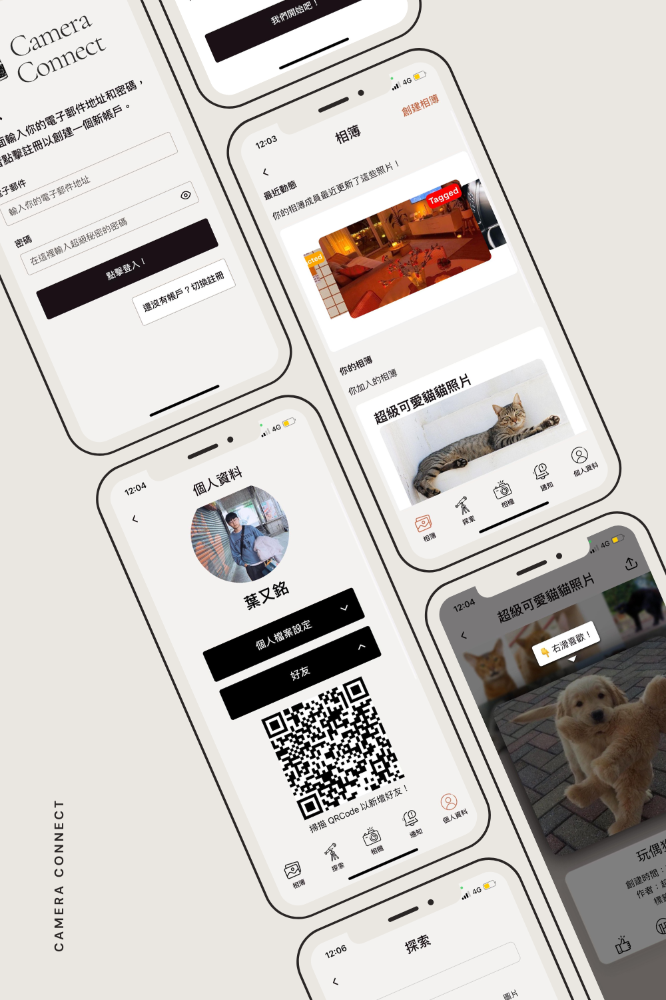

<p align="center">A mobile application designed to streamline the photo and video sharing process, enabling users to share life's moments instantly within closed ones.</p>


## Table of Contents
- [Table of Contents](#table-of-contents)
- [Our Vision](#our-vision)
- [Features](#features)
- [Setup](#setup)
- [Demo](#demo)

## Our Vision
In the digital era, sharing life's moments instantly is more than a convenience—it's a way of staying connected. Camera Connect emerges as a pioneering mobile application designed to fulfill this need, allowing users to share photos and videos within private groups effortlessly. This section introduces Camera Connect, highlighting its purpose, design philosophy, and the primary challenge it seeks to address.

Camera Connect is engineered to streamline the photo and video sharing process, integrating in-app capturing and editing tools, interaction features, aiming to increase the user engagement. Its aim is to transform how friends and family share experiences, simplifying the connection process and making sharing moments instantaneously.

## Features
The Camera Connect application is designed to offer a seamless user experience, providing a range of features that cater to the needs of modern-day users. This section outlines the key features of the application, highlighting its functionality, design, and user benefits.
1. **Instant Capture and Share**: Camera Connect allows users to capture photos and videos within the app and share them instantly with their private groups. The in-app camera will open up once the user opens the app, enabling them to capture moments real quick.
2. **Album Sharing and Management**: Users can create albums within the app and share them with their private groups. They can also manage their albums, add or remove photos and videos, and organize them as per their preference.
3. **Effortless Exploration**: Camera Connect offers a user-friendly interface that allows users to explore photos and videos shared by their friends and family members effortlessly. 
4. **Interactive Features**: The application includes interactive features such as comments, likes, and reactions, enabling users to engage with the shared content and express their thoughts and emotions.
5. **Tinder-like Swipe**: Users can swipe left or right to like or dislike photos and videos shared by their friends, making the interaction process fun and engaging.
6. **QR Code Connectivity**: Camera Connect offers a unique QR code connectivity feature that allows users to add friends and invite them to join their private groups by scanning the QR code.
7. **Optimized Performance**: The application is optimized for performance, ensuring fast loading times, smooth navigation, and seamless sharing of photos and videos by utilizing the local storage of the device.

## Setup
Before running the application, make sure you have the following prerequisites installed on your system:
- [Node.js](https://nodejs.org/en/download/)
- [Expo CLI](https://docs.expo.dev/get-started/installation/)
- [NPM](https://www.npmjs.com/get-npm)
- [Expo Go](https://expo.dev/client)
- [Git](https://git-scm.com/downloads)
- [Yarn](https://classic.yarnpkg.com/en/docs/install/)
- [Android Studio](https://developer.android.com/studio) or [Xcode](https://developer.apple.com/xcode/) (Optional, for running the application on an emulator)

To set up the application, follow these steps:
1. Clone the repository using the following command:
```bash
git clone https://github.com/YouMingYeh/camera-connect.git
```
2. Navigate to the project directory:
```bash
cd camera-connect
```
3. Install the dependencies:
```bash
npm install --force
```
> Note: You might need to install some dependencies manually if the installation fails. You can refer to the error messages in the terminal to identify the missing dependencies and install them using the following command:
```bash
npm install <dependency-name>
```

4. Start the application:
You have these options to start the application, but we recommend using the Expo Go app on iOS for all the features to work properly. Now, you need to connect your device to the same network as your computer and scan the QR code that appears in the terminal.
```bash
npm start
# or if you can not connect to the same network
npx expo start --tunnel
```
- For iOS: Open the Camera app and scan the QR code.
- For Android: Open the Expo Go app and scan the QR code.
- For Emulator: Press `i` to open the iOS emulator or `a` to open the Android emulator.
- For Web: Press `w` to open the web browser.

5. Once the application is running, you can explore the features and functionalities of Camera Connect on your device or emulator. Enjoy sharing life's moments instantly with your friends and family!

For more information on the application, refer to the [documentation](https://github.com/YouMingYeh/camera-connect/tree/main/docs)

## Demo
1. Video Demo: [Camera Connect Video Demo](https://drive.google.com/file/d/1E6wPS3EVAFbnrVsIrRBG66Rq9EtXnkXU/view?usp=sharing)
2. Automated Acceptance Test: [Camera Connect Automated Acceptance Test](https://drive.google.com/file/d/1GCuYVclHA6T3XyAXSY64czR8EKlrlZck/view)
3. Usability Testing: [Camera Connect Usability Testing](https://drive.google.com/file/d/1_-K65GMtYCUqlMiqSLbI3qjaT1xHAO-m/view?usp=sharing)
